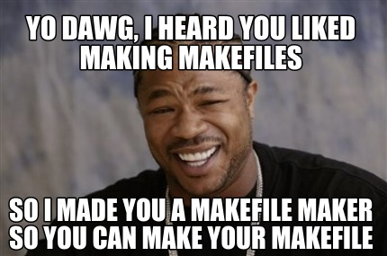

# Easy Makefiles with easyMake


easyMake is a proof of concept for a simple way to generate Makefiles based on an R dataframe listing file dependencies. It is not on CRAN, but you can install it with:

```
devtools::install_github("GShotwell/easyMake")
```

Make provides an incredibly powerful way to manage analysis projects. By using a Makefile to specify the way in which the files in your project depend on one another you can ensure that your analysis is always up to date, and that files are not being needlessly regenerated if nothing has changed. Using a Makefile is one of the best things that you can do to ensure that your analysis project is robust and reproducible. Writing a Makefile, however, requires learning a new programming paradigm, which is something many R users are uncomfortable with. Since it is often easier to edit an existing Makefile than to generate a new one from scratch, easyMake provides a set of tools to quickly and easily set up your own Makefile. 

easyMake is based on the principle that most R projects are built around R scripts which execute various actions, and artifacts which are the inputs and outputs to those scripts. For instance, you might write a script which reads in a dataset, alters it in some way, and then saves it as a new file for another script to read. The Input -> Script -> Output structure of many R projects lets us detect dependencies between files by detecting which artifacts are read into each script. If a script imports a file `data.csv` with, `read.csv()` then `data.csv` is a pre-requisite for that script. If it then saves it as `data2.RData`, then we know that the script is itself a pre-requisite for `data2.RData`. 

This is rolled into the easyMake function `detect_dependencies()` which reads all the R files in the working directory, identifies which files they import and export, and then builds a dependency edge list based on those relationships. The output of this function looks like this:


```r
#Create edge list mannually
dependencies <- dplyr::data_frame(
 file    = c("analysis/file2.R", "analysis/markdown.Rmd", "mtcars.csv",
 						"mtcars.RData", "analysis/file2.R"),
 pre_req = c("mtcars.csv", "mtcars.RData", "analysis/file1.R",
 					"analysis/file2.R", "R/hello.R"))
dependencies
```

```
## Source: local data frame [5 x 2]
## 
##                    file          pre_req
##                   (chr)            (chr)
## 1      analysis/file2.R       mtcars.csv
## 2 analysis/markdown.Rmd     mtcars.RData
## 3            mtcars.csv analysis/file1.R
## 4          mtcars.RData analysis/file2.R
## 5      analysis/file2.R        R/hello.R
```

There are four rules to follow to make sure that `detect_dependencies()` does a good job of identifying your file structure:

- Use RStudio projects to encapsulate all of the data, scripts, and intermediate objects in one place.
- Use explicit file names in your file import and export statements. In other words, don't assign file names programatically, but instead use the form `export(file, "filename.csv")`
- Do not use the same names for a script's imports and exports. If a script reads `data.csv` it should not write to the file `data.csv` but instead write to a new file name like `data2.csv`.
- Scripts should be pure in the sense that they only communicate with the project through their imports and exports. A script should not rely on, nor produce, any objects which are stored in memory. One way of ensuring that this is the case is to clear the global environment at the end of each script with `rm(list = ls())

I recommend that you edit the dependency edge list to make sure that it is caputuring all of the project's dependencies. Once you have the graph you can do two things with it:

## Turn it into a Makefile

The `easy_make()` function simply takes a dependency edge list, and generates a Makefile using this rules. Running `easy_make(dependencies)` on the above dependency edge list would product the following Makefile:

```
analysis/file2.R: mtcars.csv R/hello.R
	RScript analysis/file2.R
 
analysis/markdown.Rmd: mtcars.RData
	Rscript -e 'rmarkdown::render(analysis/markdown.Rmd)'
 
mtcars.csv: analysis/file1.R
	RScript analysis/file1.R
 
mtcars.RData: analysis/file2.R
	RScript analysis/file2.R
```

Makefiles are simple to construct and edit. The first line of each action defines the target file, and its prerequisites. When you build a project using a Makefile, Make checks whether the prerequisite was produced more recently than the target. If it was, then it runs the command specified in the rule. The easyMake package asumes that all of the actions are either running R scripts, or rendering Rmarkdown documents. You can of course, run other commands as part of the Makefile, you just need to add them yourself. 

`easy_make()` produces the Makefile using the following rules:

* If both the target and prerequsite are R files, run both of them
* If only one is an R file, run the R file
* If one is a Rmd file, render it. 

## Produce a Dependency Graph

If you want to take a look at your project's dependencies, you can do so using the `graph_dependencies()` function. This takes the dependency edgelist produced by `detect_dependencies()` and a charcter vector containing the complete list of files, and generates a picture of how those files depend on one another. A sample graph might look like this:


The Makefile produced by easyMake is not likely to be optimal, but hopefully it provides enough structure to get the beginning user started with building their projects from a Makefile. For more about how to use Make with R see:

